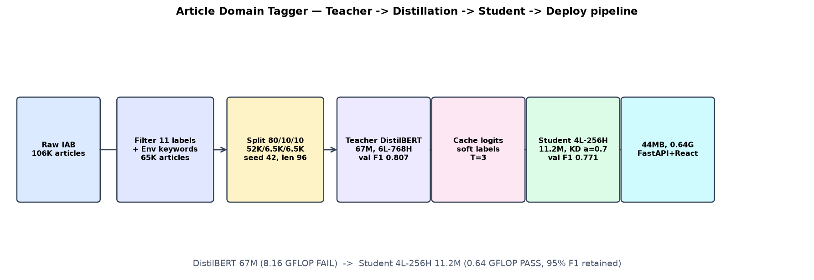
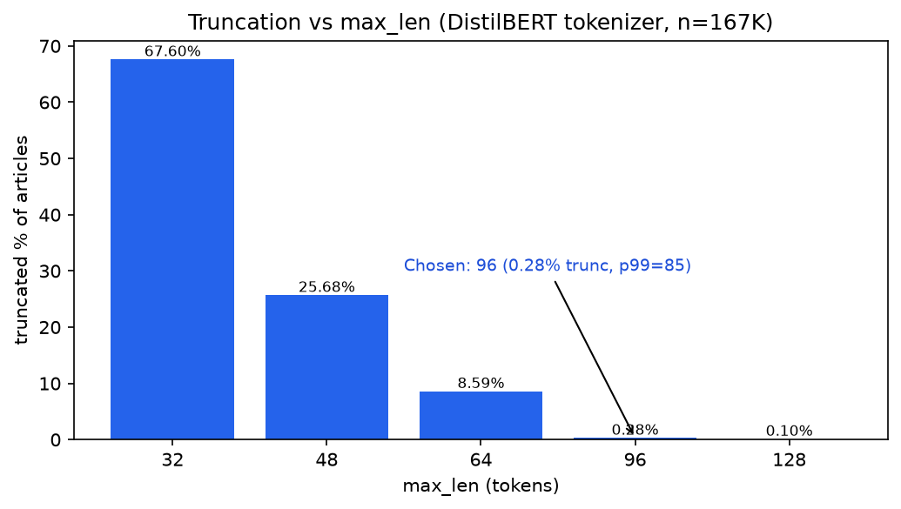
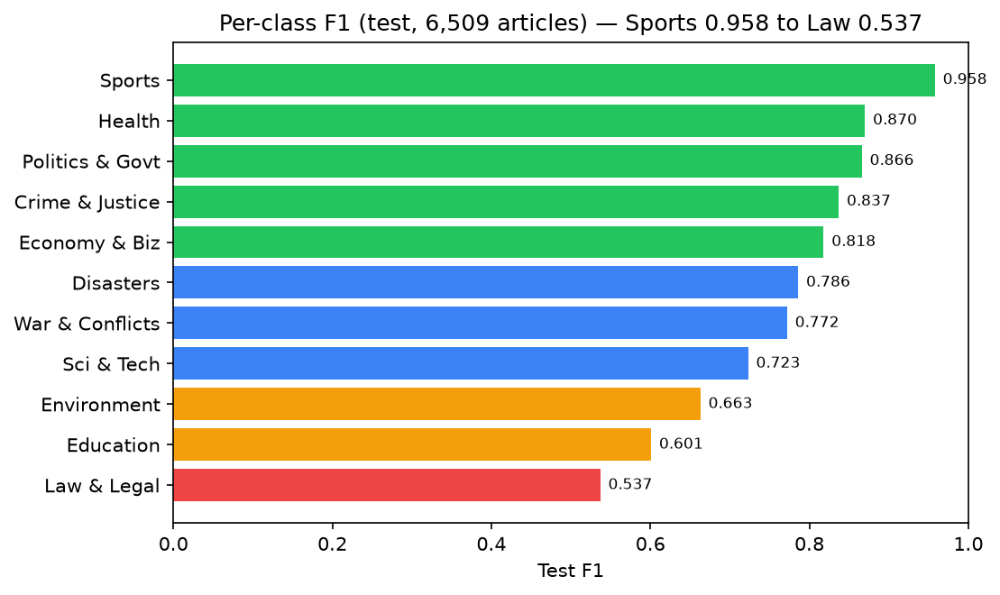
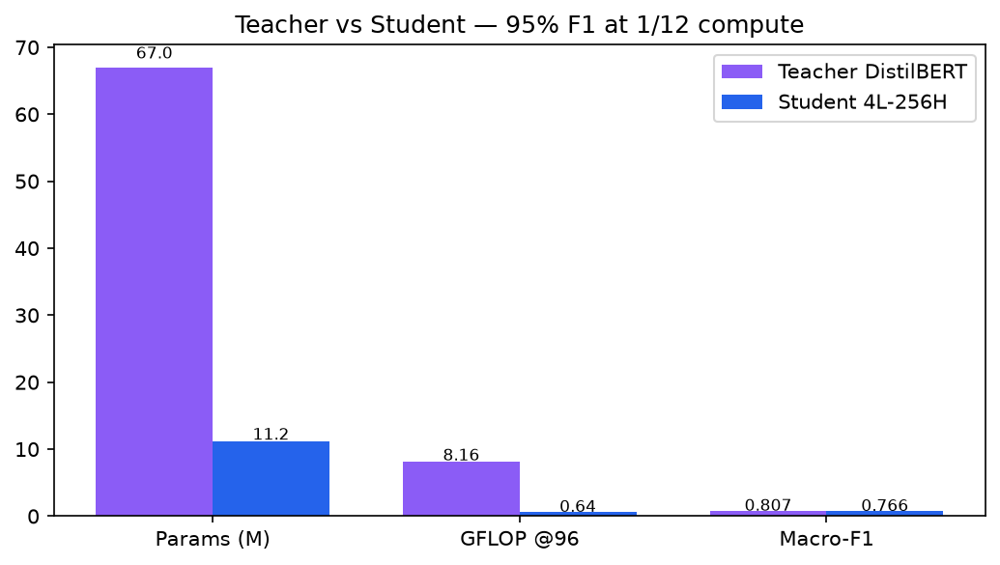
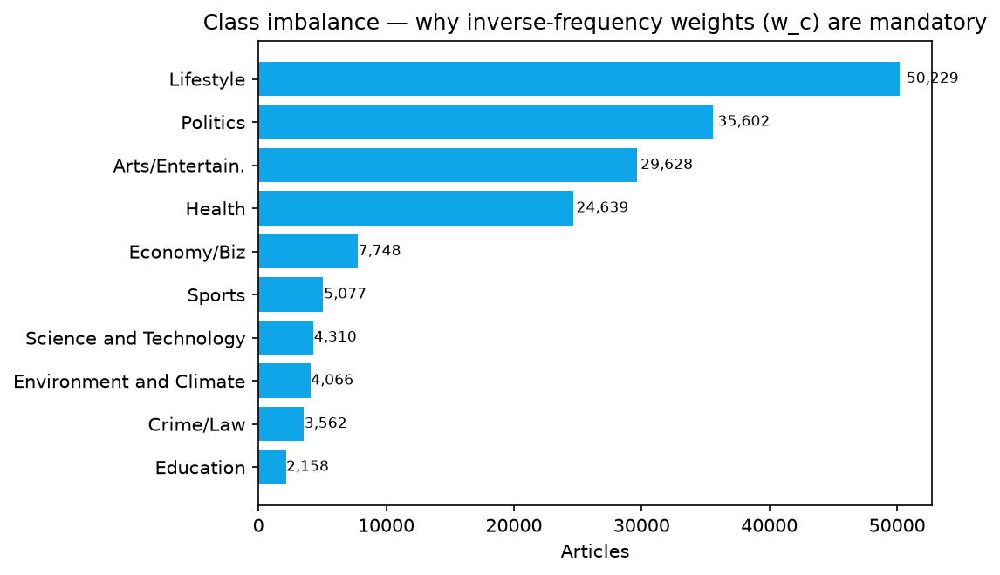

# Article Domain Tagger — Knowledge Distillation Project

> Classify news articles into **11 IAB topic domains** with a **44 MB distilled student model** (4L-256H, 0.64 GFLOP, 82.4% accuracy, 0.766 macro-F1, ~6 ms CPU).

**🌐 Project webpage (GitHub Pages):** `https://garimadevi.github.io/article-domain-tagger/`
**🎥 Video presentation:** https://youtu.be/GYFeDFcVSM8
**💻 Live demo (frontend):** deploying soon — code in [`frontend/`](frontend/), backend in [`app.py`](app.py)

By **Garima Devi** · Mentors: Assigned Mentor, **Mohd. Amaan Sir** · Faculty Advisor: **Prof. Prithwijit Guha** · Co-Advisor: **Ashwin Jacob Gigo** · Deadline: **15th Sept 2026**

---

## 1. Introduction

Large transformers (DistilBERT 67M, 8.16 GFLOP @96) are accurate but 8× over a 1-GFLOP CPU budget.
This project distills the teacher into a **Student 4L-256H (11.2M params)** that keeps **95% of teacher F1** at **1/12th the compute**.

- **Dataset:** `mdonigian/iab-news-classification` (~106K) → 11 labels → **65,083 articles**, stratified 80/10/10 (seed 42)
- **Teacher:** `distilbert-base-uncased` + 11-head, 3 epochs, LR 2e-5 → val macro-F1 **0.807**
- **Student:** KD with `T=3.0, α=0.7`, 5 epochs, seeds 42/1337 → val mean **0.771**, test **0.766 / 82.4%**
- **Deploy:** FastAPI (`POST /predict`, `POST /fetch-url`, `GET /health`) + React (`frontend/src/App.jsx`)

Full narrative + tables: [`REPORT.md`](REPORT.md). Web version of this report with video, diagrams and equations: `docs/index.html`.

## 2. Architecture



`Raw IAB → Filter 11 + Env keywords → 80/10/10 split → Teacher → Cache logits (T=3) → Student KD (α=0.7) → 44MB export → FastAPI ↔ React`

Mermaid source: [`tools/architecture.mmd`](tools/architecture.mmd)

## 3. Math (core logic)

**KD loss** (`train/train_student.py:38-43`):

```text
L = α·T²·KL(σ(z_t/T) || σ(z_s/T)) + (1-α)·CE(y, σ(z_s)),  α=0.7, T=3
```

**Class weights** (`train/common.py:40-46`): `w_c = N / (K·N_c)` — Education (~1.3%) is ~25× smaller than Politics.

**FLOP gate** (`config.py:51`, `analysis/measure_flops.py`): `GFLOP ≤ 1.0` (torch 2×MACs, bs=1 fp32). Student@96 ≈ **0.64 PASS**; Teacher@96 ≈ 8.16 FAIL.

## 4. Graphs

| Token truncation | Per-class F1 |
|---|---|
|  |  |
| p99=85 → `MAX_LEN=96` truncates 0.28% | Sports 0.958 → Law 0.537 (small classes weakest) |

| Teacher vs Student | Class imbalance |
|---|---|
|  |  |
| 95% F1, 12× efficiency | Justifies `w_c` weighting |

Regenerate: `venv\Scripts\python.exe tools\make_github_figs.py`

## 5. Results (test, 6,509)

| Metric | Value |
|---|---|
| Accuracy | **82.4%** |
| Macro-F1 | **0.766** |
| FLOPs | **0.64 GFLOP PASS** |
| Size / latency | 44 MB / ~6 ms CPU p50 |

Weak: Education 0.601 (155 rows), Law 0.537 (221 rows) — see `generated/review_ambiguous.csv` (42K rows) for future labeling.

## 6. How to run

```bash
# API
venv\Scripts\python.exe -m uvicorn app:app --reload --port 8000
# UI
cd frontend
npm install
npm run dev
# open http://localhost:5173
```

```python
from transformers import AutoModelForSequenceClassification, AutoTokenizer
import torch
tok = AutoTokenizer.from_pretrained("generated/deployed_student")
model = AutoModelForSequenceClassification.from_pretrained("generated/deployed_student").eval()
inputs = tok("Scientists discover high-efficiency solar cell material", return_tensors="pt", truncation=True, max_length=96)
with torch.no_grad():
    p = torch.softmax(model(**inputs).logits, dim=-1)
print(model.config.id2label[p.argmax(-1).item()], f"{p.max():.1%}")
```

## 7. Repo layout

```text
config.py  train/teacher_train.py  train/cache_teacher_logits.py
train/train_student.py  train/student.py  train/common.py
eval/evaluate.py  deploy/model_export.py  analysis/token_stats.py
analysis/measure_flops.py  data/taxonomy.py  app.py  frontend/src/App.jsx
generated/deployed_student/  docs/ (GitHub Pages site)  tools/make_github_figs.py
```

## 8. Publish checklist (15 Sept)

- [x] Video uploaded: https://youtu.be/GYFeDFcVSM8 (wired into `docs/index.html` + top of this README)
- [ ] Deploy `frontend/dist` to Netlify/Vercel, replace demo link in `docs/index.html`
- [ ] Push `main`, enable `Settings → Pages → Deploy from branch → main /docs`
- [ ] Share Pages + repo + video links with mentors
